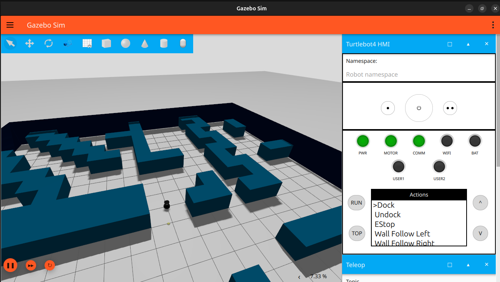
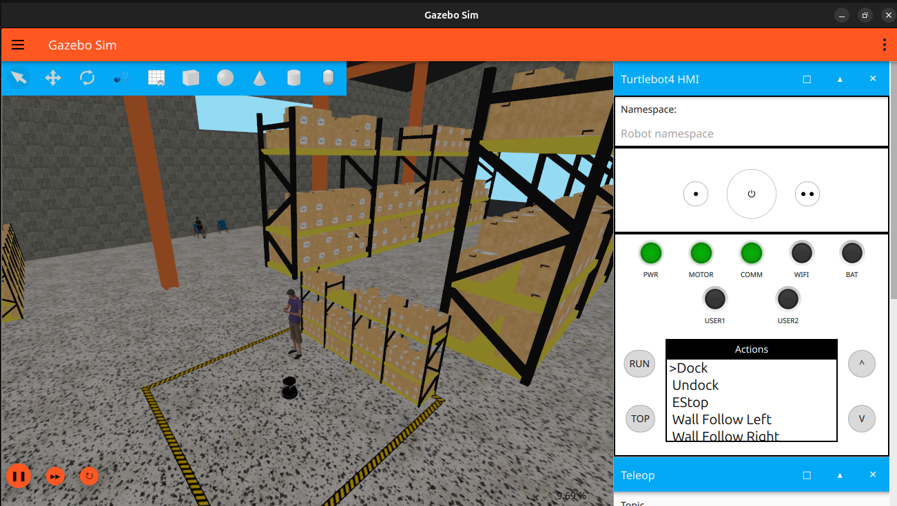
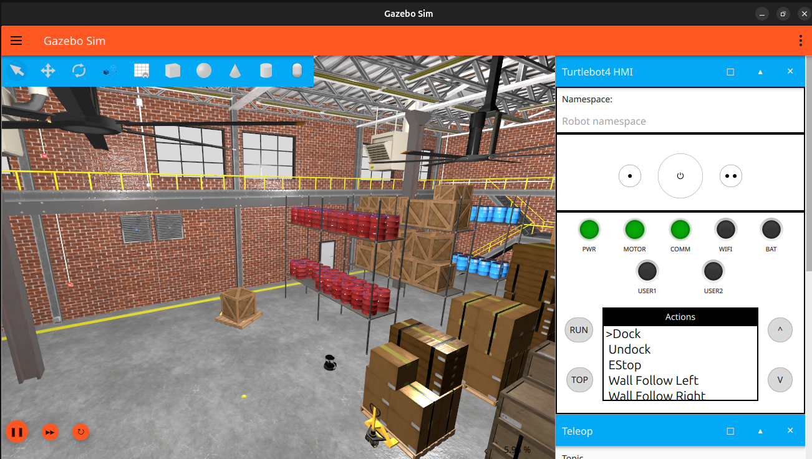
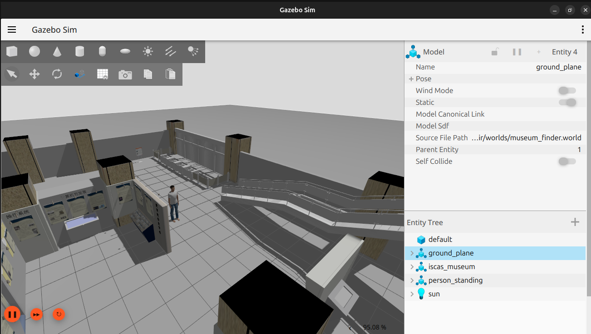
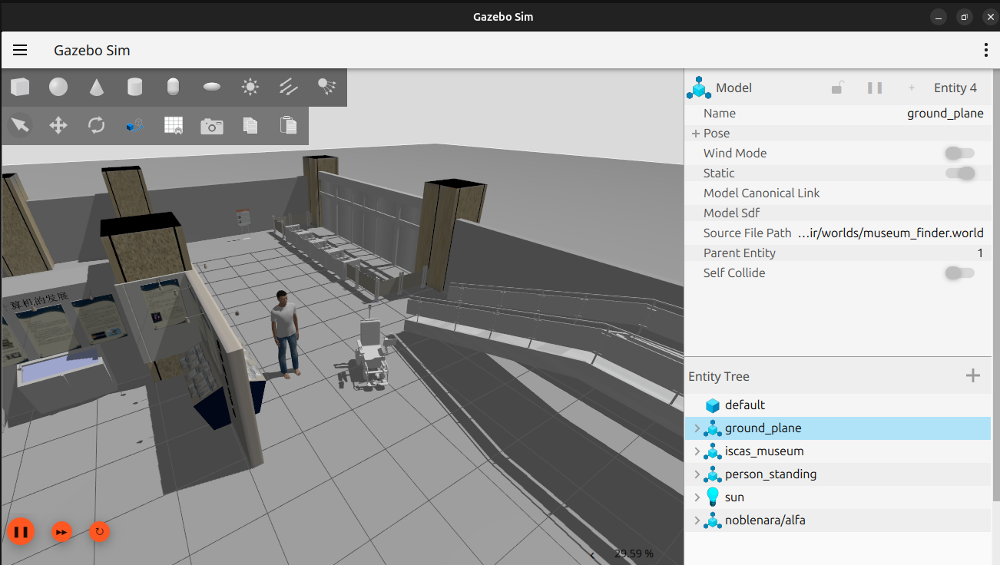
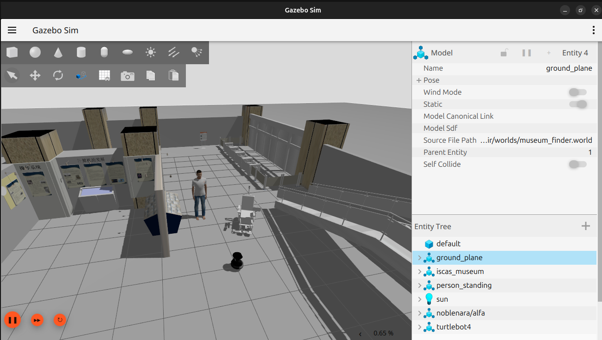

# NOBLENARA SIM

Tutorial de como utilizar a cadeira de rodas autônoma "NARA" em um ambiente virtual chamado "Gazebo". Atualmente, está incluso no projeto o uso de mapeamento e a navegação autônoma, além da possibilidade de se inicializar múltiplos robôs

```
1 - O projeto ainda está em desenvolvimento, severas atualizações são esperadas ao longo deste tempo.
2 - Incluiu-se também, na pasta "nara-sim", um tutorial para o uso do container da simulação da NARA no ROS1
```

## 1 - Como utilizar a simulação 📋

É necessário instalar bibliotecas e diferentes dependências para o correto funcionamento das simulações e pacotes. Vale considerar que o projeto foi construído utilizando o Ubuntu 24.04 e o ROS2 Jazzy, logo, possivelmente não funcionará em um sistema alternativo

Primeiramente faça a instalação do ROS2 Jazzy, seguindo o seguinte tutorial: (https://docs.ros.org/en/jazzy/Installation.html)

A simulação aqui mencionanda esta sendo testada em computadores com hardware modesto, ela consegue ser executada (Noblenara e turtlebot4 juntos) em um notebook com as seguintes especificações:

**Processador:** Intel® Core™ i3-5005U (Possui 4 nucleos)

**Memoria Ram:** 16.0 GB DDR3

**SSD:** 256 GB

**Placa de video:** Intel® HD Graphics 5500
OBS: O notebook não possui placa de video dedicada, utiliza a placa de video integrada do processador

### 1.1 - Instalando Dependências Iniciais

Posteriormente, abra o terminal e cole as seguintes linhas de código

```shell
sudo apt install python3-colcon-* \
    ros-jazzy-ros-gz \
    ros-jazzy-ros-gz-sim ros-jazzy-ros-gz-bridge \
    ros-jazzy-robot-state-publisher \
    ros-jazzy-gz-ros2-control \
    ros-jazzy-laser-filters \
    ros-jazzy-slam-toolbox \
    ros-jazzy-nav2-map-server \
    ros-jazzy-navigation2 \
    ros-jazzy-nav2-bringup
```

### 1.2 - Set - Preparando o Workspace

Com os arquivos baixados deste github, mova a pasta "noblenara-main" para o diretório padrão do seu computador, e em ***um novo terminal*** use os seguintes comandos para compilar a simulação:

```shell
cd ~/noblenara-main/nara-sim && \
    colcon build --symlink-install
```

Agora devemos permitir que nosso pacote seja encontrado pelo sistema, juntamente com o ROS. Para isso, rode os seguintes comandos:

```shell
echo "source /opt/ros/jazzy/setup.bash" >> ~/.bashrc && \
    echo "source ~/noblenara-main/nara-sim/install/setup.bash" >> ~/.bashrc && \
    # Comandos opcionais && \
    echo "export ROS_DOMAIN_ID=0" >> ~/.bashrc && \
    echo "echo "Terminal Ativado no Domínio do ROS: '"${ROS_DOMAIN_ID}"'"" >> ~/.bashrc && \
    echo "echo "Caso queira modificá-lo, modifique o comando no arquivo .bashrc"" >> ~/.bashrc
```

Obs: O .bashrc é um arquivo que roda toda vez que um novo terminal é aberto, por isso, os próximos comandos só funcionarão se um ***outro terminal*** ser aberto novamente

## 2 - Simulação 🌎

### Abrindo o Mundo com a Cadeira

Estes são os comandos básicos para rodar a simulação via terminal, primeiramente rode o mundo:

```shell
ros2 launch smartwheelchair worldmuseum.launch.py
```

Em outro terminal inicialize a cadeira

```shell
ros2 launch smartwheelchair noblenara.launch.py robot_codename:=alfa
```

Para inicializar múltiplos modelos, rode o mesmo comando em outro terminal modificando 'alfa' para um outro nome qualquer, contudo, tenha certeza que o primeiro modelo não está na área inicial (mova-o com teleop do gazebo ou de outra forma)

### 2.1 - Noblenara e Turtlebot4

Para executarmos os dois robos de serviço no mesmo mundo, primeiro precisamos instalar os pacotes do turtlebot:

#### Pacotes para o Ubuntu 24.04

```
sudo apt update
```

```
sudo apt install ros-jazzy-turtlebot4-desktop
```

#### Pacotes para a Simulação do Turtlebot4

```
sudo apt install ros-jazzy-turtlebot4-simulator
```

### (Opcional) Caso queira compilar o projeto de forma manual ou não consiga executar os passos acima:

Verifique no repositorio oficial:

https://github.com/turtlebot/turtlebot4_simulator

Documentação do Turtlebot4 no Ros2 Jazzy

https://turtlebot.github.io/turtlebot4-user-manual/software/turtlebot4_simulator.html

#### Iniciando e testando Turtlebot4

O projeto do turtlebot 4 é bem completo e por isso acaba sendo pesado para ser executado, ele já possui sua propria IHM e seus cenarios de teste são bem detalhados, exigindo bastante poder de processamento

O Turtlebot 4 possui duas versões e três mundos para teste, podemos escolher diferentes mundos e versões mudando os parametros no comando de inicialização, os paramentros para o turtlebot são:

* model:=standard
* model:=lite

Os parametros para escolher os cenarios são:

* world:=maze
* world:=warehouse

* world:=depot


Inicie a simulação em um labirinto, ele foi construido para testar metodos de navegação autonoma:

```
ros2 launch turtlebot4_gz_bringup turtlebot4_gz.launch.py model:=standard world:=maze
```



```
ros2 launch turtlebot4_gz_bringup turtlebot4_gz.launch.py model:=standard world:=warehouse
```



```
ros2 launch turtlebot4_gz_bringup turtlebot4_gz.launch.py model:=standard world:=depot
```



### Mapeamento (Nav2) no turtlebot4


**Mapeamento (SLAM):**

```
ros2 launch turtlebot4_navigation slam.launch.py
```


**Visualização no RViz:**

```
ros2 launch turtlebot4_viz view_navigation.launch.py
```

### Noblenara e Turtlebot4 no museu

Agora que temos tudo testado e instalado na noblenara e no turtlebot4, vamos inicialos no museu, para isso iremos executar um launch que faz o spawn do museu, porém carrega os pacotes necessarios para futuramente fazer o spawn da noblenara e do turtlebot4, execute:

```
ros2 launch smartwheelchair worldMuseumTurtlebot.launch.py
```



A versão desse museu acima possui uma pessoa, ela será essencial para testarmos o sistema Finder

Agora vamos iniciar a noblenara:

```
ros2 launch smartwheelchair noblenara.launch.py robot_codename:=alfa
```



A cadeira ira iniciar nas coordenadas (0,0,0), mova-a manualmente para outro local para 'spawnarmos' o turtlebot4, execute: 

```
ros2 launch smartwheelchair spawn_turtlebot4.launch_.py
```



Agora temos o museu com os dois robos de serviço e com cenario adequado para testar as tecnologias desenvolvidas 

### Inicializando o Slam da Noblenara

Para inicializar o slam de um dos robôs juntamente com o rviz2, simplesmente rode o comando:

```shell
ros2 launch smartwheelchair slam_rviz.launch.py robot_codename:=alfa # Use slam.launch.py para abrir apenas o slam
```

O robot_codename deve ser o mesmo do robô desejado, anteriormente inicializado no mundo. Não obstante, podemos inicializar este comando novamente em um terminal alternativo para outro robô

*Caso queira*, o mapa pode ser salvo diretamente pelo slam_toolbox

```shell
ros2 service call /noblenara/alfa/slam_toolbox/save_map slam_toolbox/srv/SaveMap "name: {data: 'my_map'}" # Troque "alfa" pelo codenome do robô selecionado
```

### Inicializando a Navegação Autônoma 🗺️

Por fim, a navegação pode ser inicilizada individualmente para cada robô com o seguinte comando:

```shell
ros2 launch smartwheelchair nav2_launch.py robot_codename:=alfa
```

No Rviz2 do robô desejado, utilize "2D Goal Pose" para mandar comandos para a cadeira
